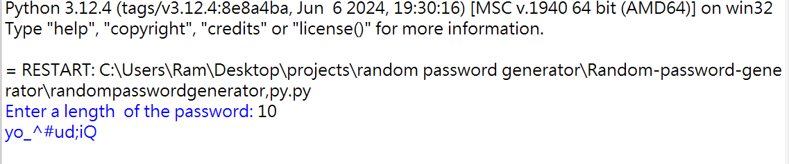

<h1>Python random password generator</h1>
<h3>
  Simple_password-generator 
</h3>

<ul>
  
Is the simple 1 to 16 digit password generater python function

  
with the help of the simple Libraries suc as the string and Random

  
This include the all the alphabet',number's and special symbols 

</ul>

